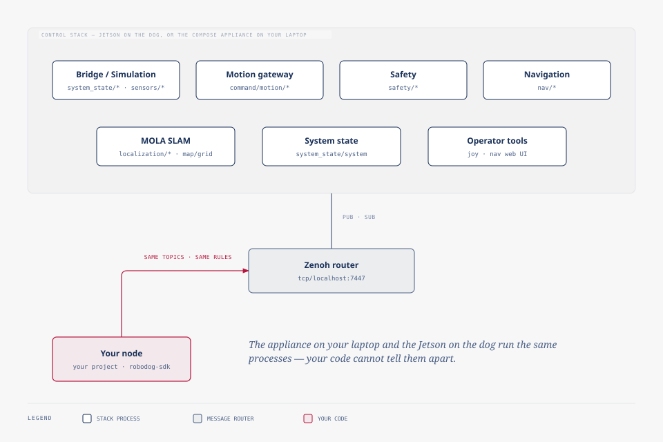

# Architecture

The control stack runs as several separate processes rather than one
program, each with one job, talking to each other and to you only through
published messages. There is no central coordinator and no function you call
to reach another process. The topics in `robodog_sdk.topics` are the entire
interface, and this page is the map of who publishes and subscribes to what.

## The process roster

Each of these runs as its own process, independently started, independently
restartable, and unaware of the others except through the topics it reads
and writes.

### Robot bridge, or simulation

Talks to the Go2's own firmware, or to the MuJoCo physics simulation
standing in for it on your laptop. It is the source of
`system_state/highstate`, `system_state/odometry`, `system_state/battery`
and `system_state/motor`, and of the camera and LiDAR sensor streams. It is
also the only subscriber to `command/motion/move`: whatever the motion
gateway decides, this is the process that turns it into leg motion.

The simulation covers the same motion and sensor surface (the same
odometry, the same camera and LiDAR topics) but not `system_state/battery`.
There is no battery to model in physics, so the key carries nothing while
you run against the simulation; code that reads it only sees real values
against the physical dog.

### Motion gateway

The single point every movement command passes through. It subscribes to
its own inlet, where every source (your code, a human on the gamepad, a
navigation skill) publishes a candidate command, picks whichever fresh one
carries the highest rank, runs it past the collision zones, and republishes
the survivor on `command/motion/move`. It also reports its own decision on
`motion/gateway/status` and raises collision events as they fire and clear.
It never originates a command of its own; it only arbitrates and forwards.

### Safety

Owns the emergency-stop decision. It aggregates every physical and software
stop source into one authority, `safety/state`, republished on a heartbeat as
well as on every change, so a dropped packet only delays the next update. A
legacy edge-triggered mirror of the same latch exists for older consumers,
but `safety/state` is the one to read. The e-stop shim is the piece that
turns a physical button or software cancel into that shared state.

### Navigation coordinator

Runs the task lifecycle behind `robot.navigate_to(...)`: accepts a task
submission, tracks it to one of its terminal outcomes, and streams progress
while it runs. It also owns the costmaps and the currently committed path.
When a task needs the robot to move, the skill driving it publishes into the
motion gateway's inlet the same way anything else does. The coordinator does
not have a private path around arbitration, so its requests compete for the
robot exactly like yours would.

### MOLA SLAM

Consumes the Livox LiDAR's point cloud over Zenoh and turns it into the
robot's map-frame position. It publishes `localization/pose` (the fused pose
consumers should read instead of raw odometry), `localization/map_identity`,
which says which map that pose is anchored to, and `map/grid`, the occupancy
grid it builds. Exactly one process publishes `localization/pose` at a time:
MOLA when it is running, or a fallback odometry node when it is not, never
both.

### System-state

Fuses the raw robot-state streams, safety, and the fleet runtime into one
composite, `system_state/system`, the key to read when the question is
"what is going on" rather than "what is this one sensor reporting."

### Joy

Reads a connected gamepad and turns its input into movement commands, at
`controller` rank, the highest rank the arbitration recognizes. That rank
is what makes it preempt anything else driving the robot the instant someone
touches the stick, with no lock to take and nothing to hand back.

### Nav web UI

The browser page you opened in chapter 2. Clicking a point on its map
submits a navigation task through the same coordinator and the same task
lifecycle `robot.navigate_to(...)` uses from code. It is an ordinary client
of the stack.

## The appliance and the dog are the same stack

The appliance you brought up in chapter 2 and the Jetson riding on the dog's
back run the same processes, publishing and subscribing to the same topics
under the same namespace. Nothing in your code can tell them apart, and
nothing is supposed to: you point `zenode.toml` at a different address and
everything else about your program is unchanged. The whole guide relies on
that: you develop and test against the simulation, then run the identical
node against hardware.

## Where each process's messages are specified

The process roster above says what each process is for; it does not enumerate
every field of every message. That lives in the
[topic reference](../reference/topics.md), generated from the same
`robodog_sdk.topics` declarations these processes publish and subscribe
against.
