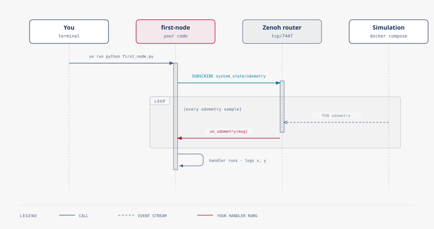

# Asyncio, as met through zenode

Every handler you write in a node is `async def`, and that is not a style
choice you could opt out of. A node does many things at once — reacting to
whichever topics it subscribes to, running its own timers, maybe a
long-lived background job — and it does all of it on a single thread, using
one event loop. The loop only makes progress on the next thing once whatever
is currently running hits an `await` and hands control back. This page is
the part of asyncio that matters for that: what happens if you don't hand
control back, the three ways code runs inside a node, and what zenode is
already doing for you so you don't have to.

This is not a general asyncio tutorial — just enough to work confidently
inside a zenode node.

## The one rule: never block

Because every handler, timer, and job shares one thread, anything that runs
without ever hitting an `await` — `time.sleep(...)`, a heavy computation
loop, a synchronous network call, blocking file or serial I/O — does not
just delay itself. It freezes the entire node. Every other subscription
stops being serviced, every timer stops firing, for as long as that one call
runs.

On this stack that is not an abstract performance concern; it has a
concrete robot symptom. If the frozen code was supposed to keep republishing
a movement command, nothing does — the deadman from
[pub/sub](pubsub.md) has nothing fresh to look at, and within
`COMMAND_MAX_AGE` the gateway stops the robot, exactly as if your process
had crashed. A three-second blocking call can read, from the gateway's side,
identically to a three-second outage.

The fix is almost always mechanical:

- Waiting for time to pass: `await asyncio.sleep(...)`, never `time.sleep(...)`.
- Work that is genuinely blocking and cannot be rewritten around
  `await` — a serial port read, a synchronous library, a heavy synchronous
  computation — hand it to `await self.blocking(fn, *args)`. That runs `fn`
  on a worker thread instead of the event loop's thread, so the rest of the
  node keeps responding to messages while it runs.

```{tip}
If a handler needs longer than a moment and you are not sure whether the
call in the middle of it blocks, assume it does until you have checked.
`await self.blocking(...)` is the safe default for anything you didn't
write yourself.
```

## Handlers, timers, and spawned jobs

Code runs inside a node in exactly three ways:

- **`@subscribe(...)`** — a message arrived on a topic you're listening to,
  and the decorated method runs in response. This is most of what you have
  written in this guide: `on_odometry` in chapter 3, the collision-aware
  handlers in later chapters.
- **`@every(...)`** — the clock, not a message, triggers the call, on a
  fixed interval. Nothing arrived; time simply passed. Use this for polling
  or periodic work that isn't naturally tied to any one topic.
- **`self.spawn(coro, name=...)`** — a coroutine started as its own
  background task, owned by the node for as long as the node runs and
  canceled automatically when it stops. Chapter 4's driving node uses this
  to run its drive routine concurrently with `on_start` returning, so the
  node is fully up and responsive while that routine is still in progress.

The three cover different shapes of "when should this run": on a message,
on a schedule, or for the life of the node as its own task. Most nodes in
this guide only ever needed the first; reach for `@every` or `spawn` once
something genuinely does not fit inside "runs when a message arrives."

## Waiting for several things

Two situations come up often enough to name directly:

- Waiting on several awaitables at once, in parallel rather than one after
  another: `asyncio.gather(...)`.
- Bounding how long you're willing to wait for one: `asyncio.wait_for(...)`,
  or an awaitable's own `timeout=` parameter where it offers one. The
  `timeout=` keyword you have already used on `robot.navigate_to(...)` and
  similar `RobotClient` methods is exactly this — the SDK is not inventing a
  new waiting convention, it is exposing the one asyncio already has.

## What you do not need

`zenode.run(Node)` (or the `run()` your project's entry point calls) owns
the event loop for the entire lifetime of your program. It creates the
loop, starts your node on it, and shuts it down cleanly on exit. You do not
call `asyncio.run(...)` yourself, you do not create or manage an event loop,
and you do not need to reach for raw `threading` to get concurrency — the
loop, plus `@subscribe`, `@every`, and `spawn`, is the entire concurrency
model a node needs.

If you find yourself copying event-loop boilerplate from a general asyncio
tutorial — `asyncio.get_event_loop()`, manual `run_until_complete`, a
`Thread` wrapping a loop of its own — stop: `zenode.run` already did that
for you, and adding your own on top of it is the most common way to end up
with two event loops fighting over the same node.


