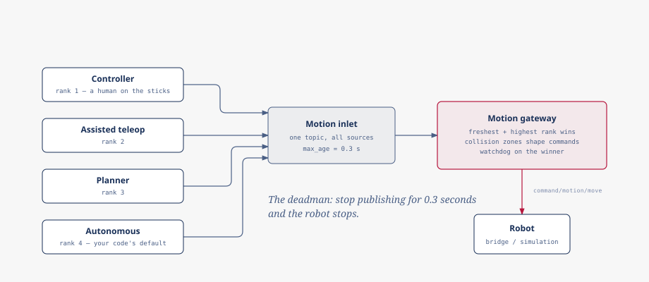

# Motion

Every velocity a robot ever executes passes through one inlet and one
arbiter: whichever fresh command carries the highest-ranking source wins,
the collision zones get to shape what survives, and silence (from you, from
whoever currently outranks you) falls through to a stop within a fraction of
a second. This page is the mechanism behind `robot.move(...)`,
`robot.driving(...)` and the postures alongside them: what "highest-ranking"
means, why a dropped connection is safe by construction, and where tilt
breaks from all of it.



## Two supported ways to command

`robodog_sdk.topics.MotionTopics` declares the inlet, and
`robodog_sdk.msgs.motion.MovementCommand` is the payload on it. Publish one
yourself and the gateway treats it exactly like any other candidate:

```python
from zenode import publish
from robodog_sdk import MotionTopics, MovementCommand

cmd = publish(MotionTopics.request)
cmd.put(MovementCommand(x=0.3))
```

`RobotClient` sends the same message, on the same key, at the same priority.
It is a convenience facade over the contract: `robot.move(x=0.3)` builds and
publishes that identical `MovementCommand`. Nothing it does is reachable
only through it.

Publishing to the contract directly is fully supported.
`examples/client_drive.py` and `examples/contract_drive.py` drive the same
fixed distance, one against `RobotClient` and one against
`MotionTopics`/`MovementCommand` directly; diffing the two shows what the
client adds (republishing, a typed `state` view, `preempted_by`), and that
none of it is required to command the robot.

## The deadman

The inlet declares `max_age = COMMAND_MAX_AGE`, currently `0.3` seconds. A
command older than that does not execute as a stale value: the gateway
treats it as absent. Stop publishing, for any reason, and within 0.3
seconds the robot is being told nothing at all, which the gateway resolves
the same way it resolves genuine silence: zero velocity, or a handover to
whichever lower-ranking source is still publishing.

`robot.driving(...)` exists because a single `move()` only lasts one command's
worth of time: it republishes your velocity in the background at 10 Hz (well
inside the 0.3 s window, so one dropped sample never costs you the deadman)
and always sends a stop on the way out of the block, including on an
exception.

```{warning}
Command age is judged by comparing a timestamp set on the publisher's machine
against the clock on whichever machine evaluates it, which is frequently a
different host. That comparison only means anything if the clocks agree, so
the deployment requires synchronized clocks (NTP or chrony) across every
machine involved. Drifted clocks make every command look stale the instant
it arrives, with nothing in the failure to say why.
```

## Arbitration

Every source (a human on the gamepad, a navigation skill, your own node)
publishes candidate commands to the same one inlet. There is no queue and no
handshake: the gateway looks at whatever is fresh right now and forwards the
command whose `MovementSource` ranks highest, lowest to highest:

```
autonomous < planner < assisted_teleop < controller
```

Nothing is acquired and nothing is released. Priority rides on every frame,
so preemption and its resolution both follow from that: a higher-ranking
command starts winning the instant it appears, and a lower-ranking one that
keeps publishing resumes automatically the moment the higher one falls
silent. There is no lock to give back and no message that says "I'm done
now."

`MovementCommand.source` defaults to `autonomous`, the lowest rank, which is
also the correct default for code you write: it is the one rank that cannot
take the robot away from a human by accident.

```{warning}
Setting a higher `source` is not a way to win the arbitration: it is a claim
to *be* that source. `controller` means "a human is holding the gamepad right
now"; `assisted_teleop` means "human intent, shaped by a skill." Pass one only
if your process is that thing. Claiming `controller` from an autonomous
routine means a real human's gamepad input no longer reliably outranks you,
which defeats the point of the ranking.
```

## The gateway's own report

The gateway publishes its own decision on `motion/gateway/status`:
`active_source` (who is currently being forwarded), `action` (what the
collision monitor did to that command), `active_zones` (which zones caused
it), and `watchdog_tripped` (the active source went silent and the gateway is
holding the robot at zero until it speaks again). This is the first thing to
read when a command goes out and the robot does not move, because it names
the reason.

It is published on every change and re-asserted on its own regardless, about
once a second. That heartbeat is what makes its age meaningful: a status that
has gone stale for several seconds means the gateway process itself is gone,
not that nothing has changed since the last edge.

## Collision zones shape commands

`GatewayAction.stop` does not mean the command becomes zero. A breached stop
zone is directional: the gateway strips only the velocity component heading
toward the obstacle, leaving motion away from it and rotation intact, so the
robot can still reverse or turn its way out rather than being pinned. Full
zeroing only happens for an obstacle that surrounds the robot, a LiDAR scan
that has gone stale, or a tripped watchdog: read `active_zones`, not `action`
alone, if the question is what the robot may still do.

## Velocity limits

`MovementCommand` validates every field against `robodog_sdk.limits` as it is
constructed. A value outside the robot's capability envelope never reaches
the wire at all: it raises `pydantic.ValidationError` in *your* process, at
the call site, before anything is published. There is no client-side clamping
to fall back on and none to add: if a limit is wrong, the fix belongs in
`limits.py`, not in a workaround around the model.

```{note}
`robodog_sdk.limits` documents its own linear, lateral and yaw-rate figures as
conservative placeholders pending confirmation against the robot; only the
tilt limits are measured. The validation behavior above holds regardless of
where those numbers end up.
```

## Postures are different

Tilt does not go through any of the above. `robot.tilt(...)` and
`robot.hold_tilt(...)` publish to a key the motion gateway never sees: no
arbitration between sources, no collision-zone cover, and no deadman: the
tilt key carries no `max_age` at all.

A single `robot.tilt(pitch_deg=10)` lasts one control frame; the robot
itself relaxes back to neutral afterward, and nothing on the wire expires
it. It is a nudge. `robot.hold_tilt(...)` is what holds a posture: it
starts a background task that re-asserts the setpoint at 10 Hz
(`TILT_RATE_HZ`) until it is changed or cleared. While the held setpoint is
exactly zero, the pump publishes nothing at all; `robot.clear_tilt()` (which
is `hold_tilt()` with every angle at its default) stops the pump and sends
exactly one leveling frame rather than none, so a bridge that latches the
last orientation does not keep the robot leaning forever. `async with
robot.tilting(...)` holds an orientation for the duration of a block and
restores whatever hold was active before it on exit, not level, so nesting
a temporary tilt inside a standing one returns to that standing hold.

```{warning}
Because tilt bypasses arbitration entirely, two nodes holding different
setpoints do not preempt each other the way movement commands do: there is
no rank to compare. They fight silently, every 100 ms, with whichever one
published most recently winning that frame and no error from either side.
Coordinate who owns a tilt yourself; the gateway has no part in it.
```
