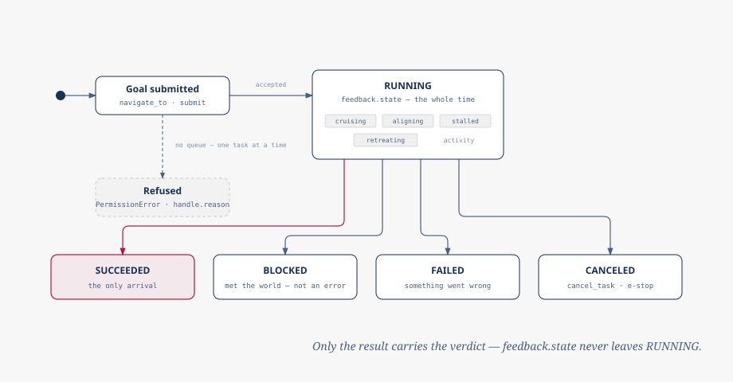

# Navigation

`robot.navigate_to(...)` and the lower-level `submit()` / `wait_for_task()`
pair frame movement as a *task* (an id with a lifetime, running inside the
navigation coordinator as one of a handful of interchangeable skills) rather
than a single command. This page is what that id means while the task runs,
what its four possible endings mean, and the two ways stored state can go
stale on you: a forgotten task id and a saved coordinate whose map has moved
on.



## Task lifecycle

A submit is answered immediately with a `TaskHandle`: `accepted`, or refused
with a `reason`. Once accepted, everything about the task while it runs
arrives on the feedback key as `TaskFeedback`, whose `state` field is typed
to `TaskState.RUNNING` and nothing else: the terminal verdict is never
published there. It lives only on the result key, once, at the end. That
split is what makes feedback and result impossible to disagree about whether
the task is still going: a feedback frame cannot carry a terminal value even
by accident.

What moves while `state` sits at `RUNNING` is `activity`: `cruising`,
`aligning`, `stalled`, `retreating`, and a few others describing what the
skill is doing right now. A `stalled` or `retreating` activity is transient:
the skill met something and is still trying to get past it. `activity` can
also read `blocked`, mirroring a give-up in progress, but that is not itself
the outcome: only a `TaskResult` whose `state` is `TaskState.BLOCKED`, on the
result key, means the skill actually gave up.

## The four outcomes

A task ends in exactly one of four terminal `TaskState` values:

- **`SUCCEEDED`**. The goal was reached. The only outcome that means arrival.
- **`BLOCKED`**. The skill met the world and stopped: an obstacle that never
  cleared, no plan through the map, no forward progress. This is an
  *outcome*, not an error: nothing is wrong with the robot, and retrying
  later or from elsewhere may well work.
- **`FAILED`**. The skill could not carry the goal out for a reason that
  is not the world pushing back: no pose source, no map, an unhandled error.
- **`CANCELED`**. A client cancelled the task, or another submit preempted
  it.

Check `result.state` (or the `result.succeeded` shortcut for the first case)
rather than assuming a return from `navigate_to` means arrival.

## One task at a time

There is no queue. A goal submitted while the robot is already navigating is
refused unless the submit passes `preempt=True`, which cancels the running
task first and takes its place. `navigate_to` (and the other wait-for-result
helpers) turn a refusal into a raised `PermissionError`; call `robot.submit()`
directly and read `handle.accepted` instead if you would rather branch on the
refusal than catch an exception.

## E-stop policy

By default, a task nobody is waiting on is discarded the moment an e-stop
engages. That is deliberate: a goal sent from a script or a one-shot call is
not something anyone wants quietly resuming on its own minutes after a human
walked over and hit the button. Pass `on_estop=EstopPolicy.HOLD` only when
this process owns the mission and is still there to handle the recovery:
held tasks resume once [motion is permitted again](safety.md#ask-motion_permitted).

## Asking about tasks

`task_status()` is for a process that did not watch a task itself. For a task
the coordinator still remembers (including one still running, where it
answers `TaskState.RUNNING` the same as feedback would), it returns a real
`TaskResult`; check `state.is_terminal` before treating the answer as an
outcome, the same as you would for feedback.

For a task the coordinator has no record of (never submitted, or aged out of
its bounded history), `task_status()` does not invent a placeholder state.
"Unknown" is not a value `TaskState` has. Instead the call raises: the real
exception is `zenode.ServiceError`, imported from the `zenode` package rather
than defined by `robodog_sdk` itself.

```{note}
`zenode.ServiceTimeout` (raised when nothing answers the status call at all,
usually because the navigation coordinator is not running) *subclasses*
`zenode.ServiceError`. Catching `ServiceError` alone cannot tell "the
coordinator answered and has never heard of this task" apart from "nothing
answered." Catch `ServiceTimeout` first when that distinction matters.
```

## Map identity

A map-frame coordinate (the `x, y` passed to `navigate_to`) is only
meaningful for the map it was recorded against; nothing in a bare pose says
which map that was. Store `robot.map_id()` alongside any pose you save for
later, and refuse to drive to it when the current id disagrees with the one
it was stored under: otherwise a rebuilt or re-sessioned map turns a saved
coordinate into a confident drive to the wrong place.

`map_id()` returns `None` for **no usable map** (nothing published yet, SLAM
down and the odometry fallback has no map either, or the last identity has
gone stale) and `None` never means "unchanged from before." Treat it as
"don't trust this coordinate."
