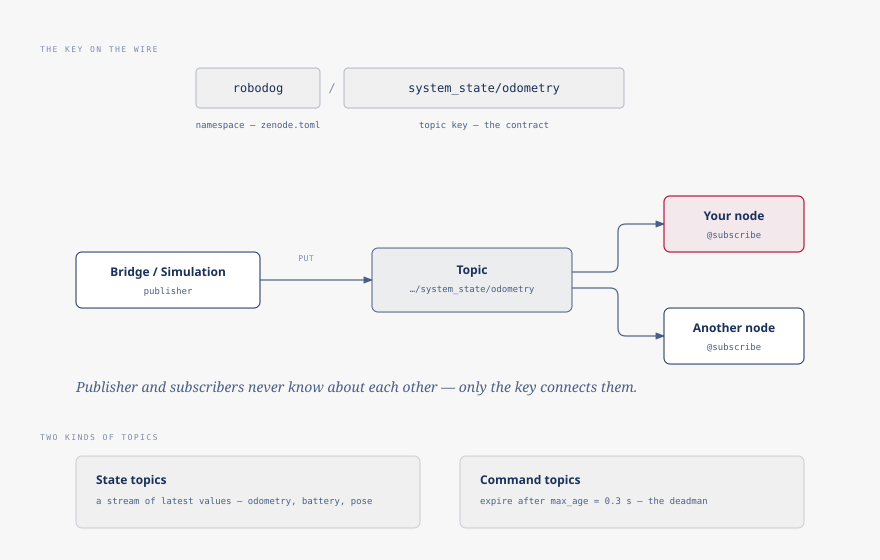

# Pub/sub

Every process in the stack, and every node you write, talks the same way:
it publishes messages on named topics and subscribes to the topics it cares
about. Nobody calls anybody else's functions. A publisher does not know who,
if anyone, is listening, and a subscriber does not know who published. How
many programs are running, where they run, and whether they are written in
Python or something else is completely invisible to your code. This page is
the mechanism behind that: what a key is, what "latched" and "expires"
mean, and how the SDK's request/response calls fit in.

## Keys and the namespace

A topic's key, as declared in `robodog_sdk.topics`, is relative:
`StateTopics.odometry` is `system_state/odometry`. Nothing on the wire is
addressed by that string alone, though. The `namespace` set in your
`zenode.toml` is prefixed to every key your node uses, so that relative key
travels as `robodog/system_state/odometry`.

The deployment you are talking to (appliance or dog, it makes no
difference) is fixed at `robodog`. That is not a placeholder you are meant
to change; it is the one value that currently addresses the stack at all.

```{warning}
Get the namespace wrong and there is no error. Your node starts, connects to
the router successfully, and simply never sees a message: it is
subscribing to a prefix nothing publishes under. Silence, not an exception,
is the failure mode, which is why it is the first thing to check when
nothing arrives. Run `uv run zenode nodes` to confirm your node is even
connected in the first place.
```



## Latched topics

`latched=True` on a topic declaration marks it as state: a value that holds
until something changes it, which is why a late subscriber should get the
current value immediately rather than waiting for the next change.
`StateTopics.odometry`, `StateTopics.battery`, `SafetyTopics.state`, and
most of the other state topics in the contract all declare it.

What the flag promises and what the stack does today are not the same
thing, though. Delivering a value to a late joiner requires the *producer*
to opt into it (the plain Zenoh publishers the stack's nodes use do not), so
on most latched keys the flag currently costs nothing and delivers nothing:
a subscriber that joins after the last publish gets silence until the next
one. `StateTopics.odometry` masks this in practice, because the robot
bridge republishes it fast enough that "the next one" is a fraction of a
second away; subscribe to `StateTopics.battery`, which updates far less
often, right after your node starts, and you can sit with nothing for a
while even though the robot is on and the value exists.

Three keys are the exception, and answer immediately regardless: `safety/state`
(`SafetyTopics.state`), `system_state/vda` (`StateTopics.vda`), and
`system_state/system` (`StateTopics.system`). The processes that produce
them back the key with a Zenoh queryable, not just a plain publish, so a
late subscriber genuinely gets the current value rather than one that
happens to arrive soon. That is a property of those three producers, not of
`latched=True` in general. It is why they behave differently from every
other latched topic in the contract, `StateTopics.battery` included.

Command topics are not latched, and for a different reason: `MotionTopics.request`
describes an instruction for right now, and there is no "current
instruction" to hand a late subscriber even in principle. It waits for the
next command, same as anyone else.

## Commands expire

A topic can declare a `max_age`; a subscriber discards anything older than
that rather than acting on it. The clearest example is the movement inlet,
where `COMMAND_MAX_AGE = 0.3` seconds doubles as the deadman: stop
publishing (your process crashes, the network drops) and within 0.3 seconds
the gateway is looking at nothing fresh enough to act on and falls through
to zero velocity, or to the next-ranking source still publishing.
See [driving](../guide/04-driving.md) for what that deadman looks like from
the driver's seat.

Age is judged by comparing a timestamp set on the publisher's machine
against the clock on whichever machine is checking it, often a different
host entirely. That comparison is only meaningful if the two clocks agree,
which is why the stack requires synchronized clocks (NTP or chrony) across
every machine involved. Let them drift and every command looks stale the
moment it arrives, with nothing in the failure to say why.

## Services

Not everything is a broadcast. Submitting a navigation task, or asking for
one task's status, is a request that expects exactly one reply: you want an
answer to *your* question, not everyone's opinion. Zenode calls this
pattern a service, and the stack uses it wherever the interaction is
genuinely request/response rather than an ongoing stream.

You will not usually declare or call a service directly. `RobotClient`
wraps the ones a typical node needs (`navigate_to`, `task_status`) behind
plain `async` methods, so from your code a service call reads like any other
`await`, not like a second API to learn on top of pub/sub.

## Seeing the wire

Three commands turn the contract from something you read in source into
something you can watch live:

```bash
uv run zenode topics --contract robodog_sdk.topics
uv run zenode nodes
uv run zenode health
```

`zenode topics` lists every declared key against the contract module, so you
can check a key or a message shape without opening `topics.py`. `zenode
nodes` lists who is actually connected right now: the check for "is my node
even here." `zenode health` reports each node's heartbeat: counters, queue
depths, handler latency, the numbers behind "how well is a node doing", not
just whether it is up.

`robodog_sdk.CONTRACT_VERSION` (in `robodog_sdk/__init__.py`, tracking the
package version) exists precisely so your project and the deployed stack can
be compared for a version skew. It is not part of the health heartbeat
today. `zenode health` reports node identity and traffic counters, nothing
about which contract version produced them.

🚧 TODO(fabian): confirm how/where CONTRACT_VERSION surfaces at runtime
(zenode health does not show it in zenode 0.1.0).
