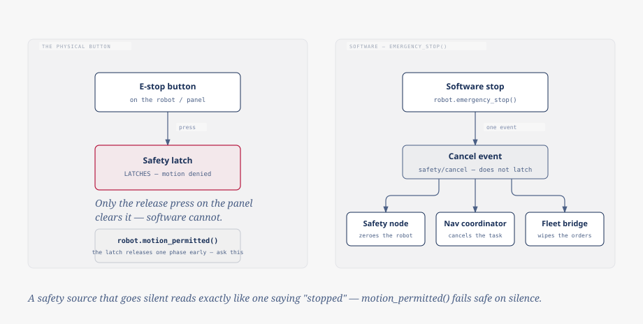

# Safety

One authority decides whether the robot may move at all, separately from
whatever the motion gateway is doing with the commands it receives. It is
built to fail toward "stopped" (on a pressed button, on a silent producer,
on a stale frame) and only one of its stop paths actually latches. This page
covers that authority, the one call that asks it correctly, and how it
relates to the collision zones that shape commands rather than block them.



## Hardware latches, software does not

`robot.emergency_stop()` publishes a cancel event that the safety node, the
navigation coordinator and the fleet bridge each subscribe to independently:
the robot is commanded to zero, the running navigation task is canceled, and
any order runtime is wiped. Each of those three does its own part on its own
subscription, so none of it depends on your process staying alive once the
event is sent.

That event does not latch, and it has no software counterpart that does.
Only the physical switch latches (engaging it is what puts the safety state
into a stopped phase) and only the release press on the panel clears that.
Software can stop the robot; it cannot stand in for the button.

## Ask `motion_permitted()`

Clearing the physical latch does not itself mean the robot may drive: the
latch drops one phase before that, deliberately, so the recovery sequence can
start standing the robot back up before anything else is asked of it. Reading
the raw latch during that window says "not stopped" while the robot is still
on the floor, which is a wrong answer if you're deciding whether to send a
command.

`robot.motion_permitted(within=...)` is the call built to close that gap.
It also fails safe on silence: a safety latch that stopped arriving reads
exactly like one saying "stopped" would, which is deliberate: a crashed
safety node or a severed link must not read as permission just because
nothing contradicts it. That is why this is a method that takes a freshness
window, rather than a plain property: the answer depends on *when* the last
frame arrived, not only on what it said.

Reading `state.safety.value.estop` directly skips both of these. Don't: it
neither accounts for the recovery-phase gap nor treats an old value as
anything other than whatever it last said.

## Zones shape, they do not own

The collision zones enforced at the motion gateway are a different mechanism
from the safety latch above, and answer a different question: not "may the
robot move," but "is something in the way of the command it was just sent."
A breached stop zone is directional rather than absolute: see [motion](motion.md#collision-zones-shape-commands)
for how the gateway strips only the velocity heading into the obstacle,
leaving the robot free to turn or reverse out. `robot.blocked_by_zone` lists
the zones currently shaping your commands for that reason.

## What this means for your node

Treat `motion_permitted()` as a wait condition, not an error condition. The
capstone patrol node in the guide checks it before starting each leg and, if
it comes back `False`, logs and waits rather than raising:

```python
while not self.robot.motion_permitted():
    self.log.info("motion not permitted — waiting")
    await asyncio.sleep(1.0)
```

A `motion_permitted()` that returns `False` is not something your node can
argue with: it is a report of a stop already in effect somewhere in the
stack. Waiting on it, the way the loop above does, is the whole response: log
it, back off, and check again, rather than treating it as a fault your node
needs to recover from.
