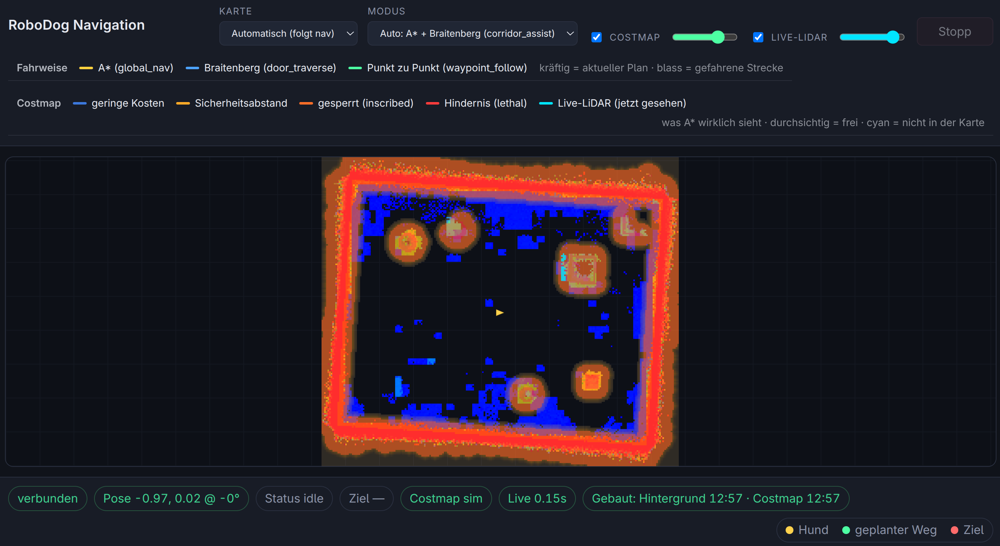

# Set up the simulated robot

```{note}
**In this chapter:** install the prerequisites; start the simulated robot
with one command; verify it by sending it somewhere from your browser.
```

Prerequisites: chapter 1 read; a laptop with about 8 GB of RAM free.

## What you need

1. **Docker.** On Windows or macOS, install
   [Docker Desktop](https://www.docker.com/products/docker-desktop/) and
   start it. On Linux, install the
   [Docker Engine](https://docs.docker.com/engine/install/) for your
   distribution.
2. **[uv](https://docs.astral.sh/uv/).** This is the Python package and
   project manager you will use throughout the guide. Follow the
   [installation instructions](https://docs.astral.sh/uv/getting-started/installation/)
   for your platform.
3. **Python 3.11 or newer.** If your system does not have one, you do not
   need to install it separately: `uv python install 3.12` gets you a
   working interpreter that uv manages for you.

## Start the simulation

1. Download
   [`sim/compose.yaml`](https://raw.githubusercontent.com/hse-deb-robodog/robodog-sdk/main/sim/compose.yaml)
   (right-click, save as) into an empty directory on your laptop.
2. In that directory, run:

   ```bash
   docker compose up
   ```

   **What you should see:** Docker pulls the images the first time, then
   starts three services (`zenoh-router`, `sim-stack`, `mola`), and the
   terminal fills with log lines from the simulation as it
   comes up. Leave this terminal running; the stack stops when you stop
   it.
3. Open `http://localhost:7070` in your browser. You should see the
   simulated robot standing in an empty scene, in a web viewer you can
   orbit and zoom with the mouse.
4. Open `http://localhost:8088/ui` (MOLA UI for SLAM), start the `Sim` source
   and start Localization on the `sim`-map.

## Send the robot somewhere, no code yet

1. Open the nav UI at `http://localhost:8091`.

2. Click a point on the map to send it as a navigation goal.
3. Switch back to the viewer at `http://localhost:7070` and watch the
   robot walk to the point you clicked.

## macOS

TODO @JB 

## Running the stack from source (optional)

If you are developing the control stack itself, or your platform can't run
the published images, you can run the stack from source instead of Docker
images. This requires access to the private
[`hse-deb-robodog/robodog-core`](https://github.com/hse-deb-robodog/robodog-core)
repository. Once you have it, its
README/setup guide has the full instructions; the quick start is:
`uv sync --all-extras` to install dependencies, copy
`config/config.toml.example` to a working config file, start the Zenoh
router with that repository's own `docker compose` file, then `uv run sim`
to run the simulation itself.

```{warning}
**Troubleshooting**

- *Port 7447 already in use:* something else on your machine is already
  listening on that port (perhaps a previous `docker compose up` you
  forgot was running). Stop it, or stop the other process, then try again.
- *Docker Desktop not running:* `docker compose up` fails immediately
  with a connection error. Start Docker Desktop and wait for it to report
  it is running, then retry.
- *Viewer is black or empty:* give the simulation about 10 seconds to
  finish starting up after the log lines appear, then reload
  `http://localhost:7070`.
```

## Where to go next

Continue to chapter 3, where you create your own project and write your
first node. For the full map of processes and topics, see
[Architecture](../concepts/architecture.md).
